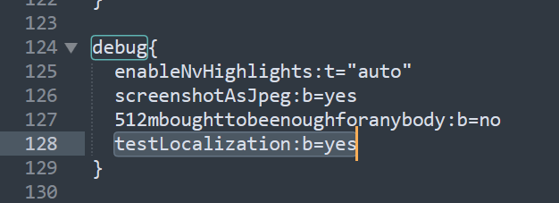
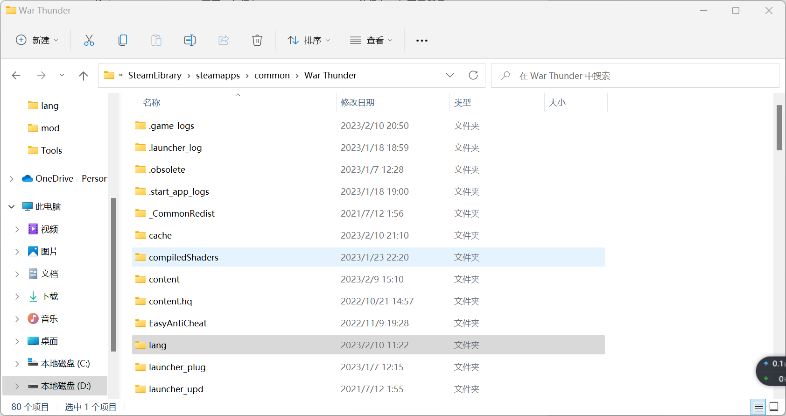

# 简介
这是一个WarThunder自定义载具名称的mod，目前仅支持英文和简体中文，其他语言为官方默认。
若有遗漏、错误或其他修改建议，请通过[B站](https://space.bilibili.com/36345740)、[KOOK](https://kaihei.co/aGkeNB)或[Discord](https://discord.gg/jpZuPczs55)联系。

修改内容包括但不限于：
+ 细化了击杀信息中显示载具的详细型号，避免混淆。例如
  - M4A1(75)和M4A1(76W)都是M4A1
  - A-10A早期型和A-10A后期型都是A-10A
  - 喷火各种型号都是喷火
  - T3485 D5T和T3485 ZIS5都是T3485
  - IS2和IS2 1944都是IS2等
  
  **注意**：细化的同时修改了详细型号的最大显示距离，默认是大概0.4km显示，mod修改为约1.2km显示，平衡性影响不大。
+ 为多个国家共有且难以区分的载具添加了更细致的国家标识，例如
  - 鬼怪
  - 馒头
  - F104
  - 佩刀等。
+ 修改了部分难以辨识的载具名称，例如38(t)坦歼、341防空等。

# 安装
1. 使用文本编辑器打开`WarThunder`根目录下的`config.blk`文件，按<kbd>Ctrl</kbd>+<kbd>F</kbd>搜索`debug`，添加`testLocalization:b=yes`并保存。
   
2. 启动游戏，登录成功后，会自动在`WarThunder`根目录下面生成一个`lang`文件夹。
   
3. 将`units.csv`文件放入`lang`文件夹，完成替换。
4. 重启游戏，完成。
   

# 如何卸载？
有两种方式：
+ 把`testLocalization:b=yes`中的`yes`改为`no`
+ 或直接删除`testLocalization:b=yes`及`lang`文件夹

# 版本更新后缺少部分文本怎么办？
1. 删除`lang`文件夹
2. 重复[安装](#安装)中的2-4
3. 此时除载具名称外，其他文本应该已经正常，等待mod更新即可